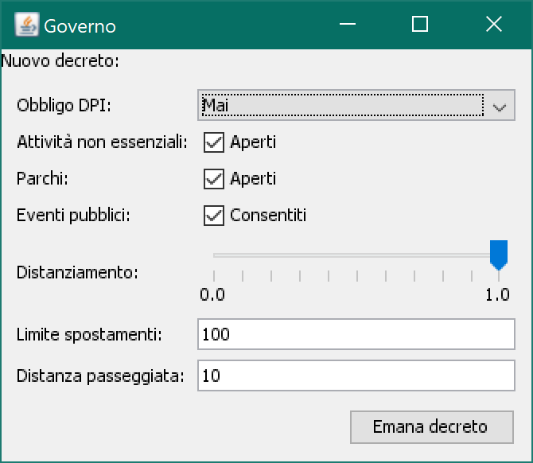

# Simulazione della diffusione di una patologia contagiosa tramite un sistema ad agenti
di Giuseppe Antonio Nanna e Nicola Flavio Quatraro

Lo scopo del progetto è quello di simulare la diffusione di una patologia contagiosa come il
COVID-19 mediante un sistema multi agente.

La simulazione riproduce tramite agenti una selezione di azioni svolte abitualmente dalle loro
controparti umane, allo scopo di mostrare in tempo reale come e in che misura iniziative e
comportamenti sia degli individui che della collettività possono prevenire o contrastare la
diffusione della patologia.

Il sistema è codificato in [Java 8](https://adoptopenjdk.net/?variant=openjdk8&jvmVariant=hotspot)
sfruttando le funzionalità della libreria [JADE](https://jade.tilab.com/).

## Agenti speciali (`com.sysag_cds.superagents`)
### `Simulation`
I parametri della simulazione vengono impostati dall'agente `Simulation` sulla base degli
argomenti passati da riga di comando nel seguente ordine:
1. Numero di `Person`
2. Probabilità di creare persone *SUSCEPTIBLE* (tra 0 e 1)
3. Probabilità di creare persone *EXPOSED* (tra 0 e 1)
4. Probabilità di creare persone *INFECTIOUS* (tra 0 e 1)
5. Probabilità di creare persone *RECOVERED* (tra 0 e 1)
6. Probabilità di creare persone non coscienziose (tra 0 e 1)
7. Probabilità di creare `Worker` (tra 0 e 1)
8. Dimensione della mappa (una griglia di forma quadrata), in termine del numero di edifici lungo
ciascun lato (>= 2) 
9. Numero di `Business`
10. Numero totale di posti letto negli ospedali

### `Statistics`
L'agente `Statistics` ha il compito di compilare le statistiche del sistema durante la sua
esecuzione mostrandole all'utente tramite un grafico aggiornato in tempo reale che consente di
monitorare i seguenti parametri:
* Numero totale dei positivi (diagnosticabili, quindi *INFECTIOUS*)
* Numero dei positivi correnti
* Numero dei guariti
* Numero dei morti (dovuti esclusivamente alla patologia)
* Numero totale dei posti letto disponibili negli ospedali

Il grafico è realizzato con la libreria [XChart](https://github.com/knowm/XChart).

### `Government`

L'agente `Government` consente all'utente di simulare provvedimenti di governi e amministrazioni
atti a contrastare la diffusione della patologia. L'agente opera emanando *decreti* (`Decree`) che
regolano il comportamento degli altri agenti, in particolare:
* l'obbligatorietà dei dispositivi di protezione individuale in ambienti chiusi e aperti
* l'apertura/chiusura di particolari luoghi pubblici/attività/eventi
* la rigidità delle norme di distanziamento sociale negli edifici (le attività
non in grado di rispettare la norma, saranno chiuse)
* la distanza massima percorribile negli spostamenti
* la distanza massima percorribile per attività motorie

In particolare tali decreti nelle modalità descritte sono dunque in grado di determinare la
chiusura degli edifici pubblici, di servizi, luoghi di lavoro e di svago.

### Altri

L'agente `HealthCare` tiene traccia del numero totale di posti letto disponibili negli ospedali. Se
ad un paziente viene negata la degenza in ospedale a causa della mancanza di posti, le sue
possibilità di sopravvivenza, ne saranno inficiate.

L'agente `EventPlanner` invita gli agenti `Person` a partecipare a eventi pubblici di massa, come
manifestazioni, concerti, ... se consentite da `Government`.

## Contestualizzazione geografica (`com.sysag_cds.world`)
Gli agenti `Person` si muovono in una rappresentazione schematizzata a grafo della mappa di una
città, con una struttura a lattice connessa e completa, i cui nodi sono gli edifici (`Building`) e
gli archi sono strade (`Road`).

### `World`
Tale struttura dati è gestita per mezzo della classe `World` mediante la libreria
[Jung](https://github.com/jrtom/jung) e offre agli agenti funzionalità per la navigazione del
grafo come:
* trovare il percorso minimo tra due nodi del grafo
* trovare la distanza minima tra due nodi del grafo
* generare percorsi verso nodi casuali
* selezionare nodi casuali nel grafo

### `Location`
`Road` (strada) e `Building` (edificio) sono sottoclassi della classe `Location` che individua un
generico luogo nella mappa. Ogni istanza di `Location` può essere vista come un generico indirizzo
ed è caratterizzata da una *density* che fissa il massimo del distanziamento sociale
possibile nella data `Location`. Per questo motivo i luoghi all'aperto, come le `Road` hanno una
*density* più bassa rispetto ai `Building`.

Alcuni `Building` possono essere le abitazioni di agenti `Person`.

### `Business`
I `Business` sono particolari agenti ognuno legati ad un diverso `Building` della mappa.
Rappresentano servizi, luoghi di svago e di lavoro che possono aprire e chiudere in base alle
disposizioni di `Government`. Si sono rappresentate le seguenti categorie di `Business`:
* `Supermarket`: in cui le Person si recano per raccogliere beni di prima necessità
* `Hospital`: in cui le Person si recano se ammalate (anche per cause diverse dalla patologia
contagiosa)
* `Park`: generici luoghi di svago. Possono essere il setting di eventi pubblici
* `Essential`: luoghi di lavoro reputati "essenziali" per la comunità
* `NonEssential`: luoghi di lavoro reputati "non essenziali" per la comunità

Tutti i `Business` possono essere luoghi di lavoro per gli agenti `Worker`.

## Persone (`com.sysag_cds.people`)
### `Person`
Gli agenti `Person` sono i protagonisti della simulazione. Ognuno di loro, in maniera indipendente
e asincrona può decidere di spostarsi nella mappa per raggiungere `Supermarket`, `Park`, `Hospital`, 
... o la propria abitazione in base alle proprie necessità. Ogni `Person` può incontrare altri
agenti e contagiarsi o rimanere contagiata.

Alcuni agenti `Person` vengono creati come non coscienziosi. A differenza degli altri, tali agenti
non rispettano le disposizioni relative al distanziamento sociale, agli spostamenti, all'obbligo
di DPI.

### `Worker`
Gli agenti `Worker` sono sottoclassi di `Person` ai quali viene assegnato un `Business` come luogo
di lavoro, nel quale vi si recano periodicamente.

### Modello SEIR
Ad ogni `Person` è associato uno stadio della malattia in accordo con il modello SEIR:
* *SUSCEPTIBLE*: individui sani che possono essere contagiati
* *EXPOSED*: individui esposti al contagio, ma che non mostrano sintomi e non possono ancora
contagiare altri. In incubazione.
* *INFECTIOUS*: individui affetti dalla patologia che possono mostrare sintomi. Sono contagiosi
* *RECOVERED*: individui guariti e/o immuni alla patologia.

### Contagio
Il contagio può avvenire quando due individui, un *SUSCEPTIBLE* e un *INFECTIOUS*, si trovano
nello stesso momento nella stessa `Location`. Il contagio avviene solo se i due individui si
incontrano (`Person.meet()`). L'incontro è considerato una violazione delle norme di distanziamento
sociale che può avvenire in base ad una probabilità che dipende dalla `density` del luogo,
decreti e dalla coscienziosità degli individui.

In seguito all'incontro può verificarsi il contagio, che può avvenire in base ad una probabilità
che dipende dall'efficacia dei DPI e se questi sono indossati.

