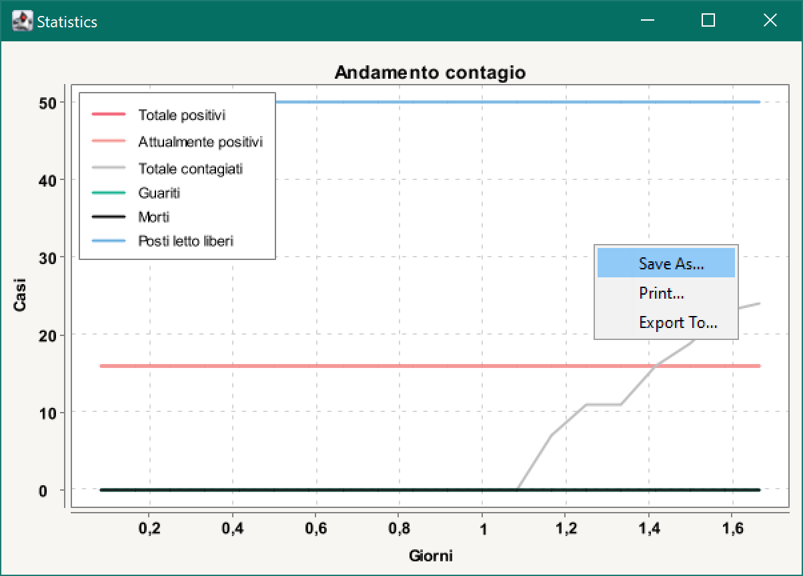
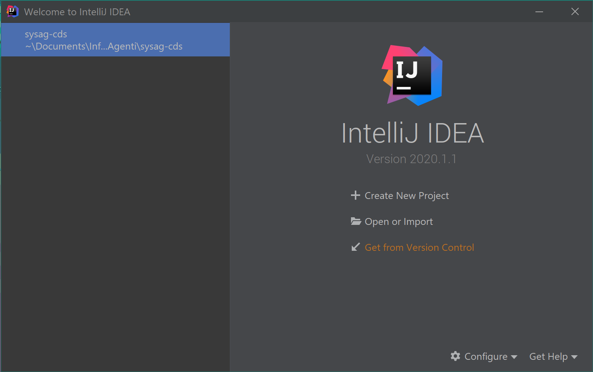
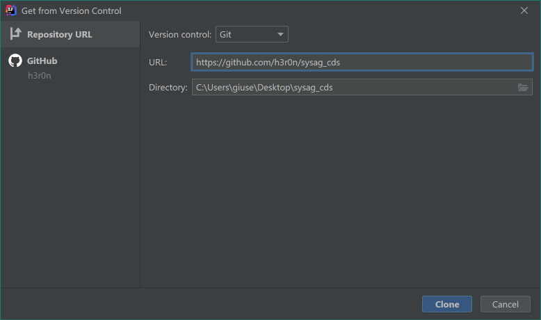
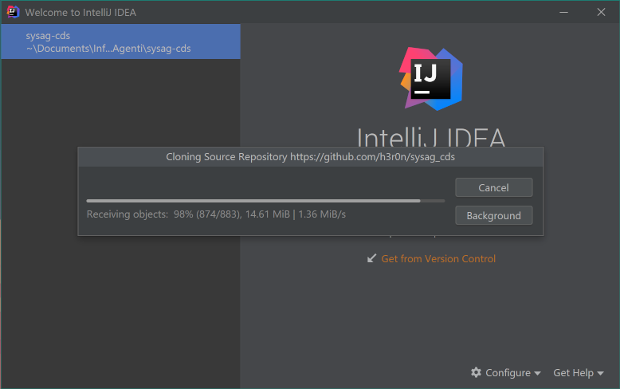
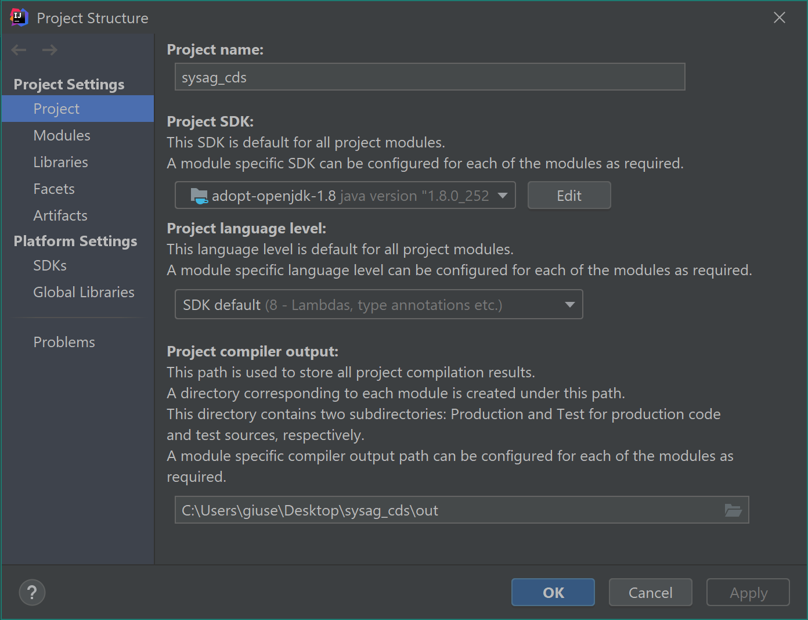
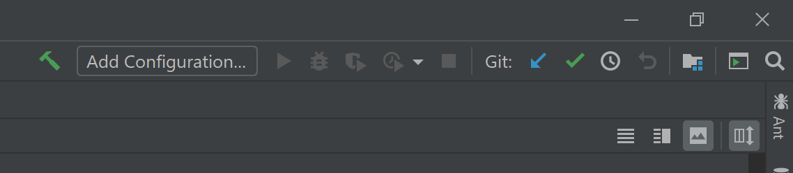
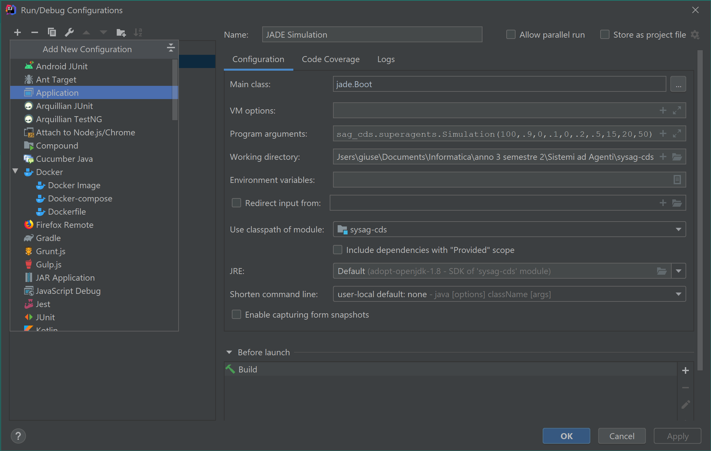
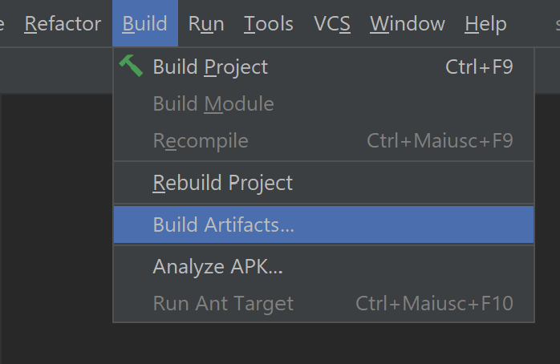
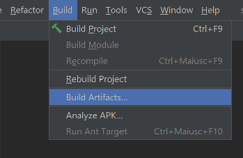
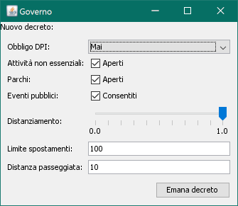

# Simulazione della diffusione di una patologia contagiosa tramite un sistema ad agenti
di Giuseppe Antonio Nanna e Nicola Flavio Quatraro


Lo scopo del progetto è quello di simulare la diffusione di una patologia contagiosa come il
COVID-19 mediante un sistema multi agente.

La simulazione riproduce tramite agenti una selezione di azioni svolte abitualmente dalle loro
controparti umane, allo scopo di mostrare in tempo reale come e in che misura iniziative e
comportamenti sia degli individui che della collettività possono prevenire o contrastare la
diffusione della patologia.

Il sistema è codificato in [Java 8](https://adoptopenjdk.net/?variant=openjdk8&jvmVariant=hotspot)
sfruttando le funzionalità della libreria [JADE](https://jade.tilab.com/).

Links:
* [Guida utente](#guida-utente)
* [Guida sviluppatori](#guida-sviluppatori)
* [Descrizione del sistema](#descrizione-del-sistema)
* [Documentazione Javadoc](https://h3r0n.github.io/sysag_cds/)

# Guida utente
#### Prerequisiti
Verificare di aver installato Java 8 o superiore. In caso contrario scaricare il JRE (il JDK è necessario
solo per sviluppatori), ad esempio da [questo indirizzo](https://adoptopenjdk.net/releases.html?variant=openjdk8&jvmVariant=hotspot).

#### Download
Scaricare l'ultima versione del file *.jar dalla pagina [Releases](https://github.com/h3r0n/sysag_cds/releases):
* `sysag-cds_accurate.jar` è raccomandato per PC meno performanti e in caso di un elevato numero di agenti (1000+)
* `sysag-cds_fast.jar` è raccomandato per PC più performanti e in caso di un limitato numero di agenti (~100)

#### Avvio 
Aprire un terminale nella cartella in cui si è scaricato il file e lanciare un comando del tipo:
```
java -jar sysag-cds_fast.jar -agents "simulation:com.sysag_cds.superagents.Simulation(100,.9,0,.1,0,.2,.5,15,20,5)"
```
* potrebbe essere necessario sostituire `sysag-cds_fast.jar` con il percorso del file scaricato
* potrebbe essere necessario sostituire `java` con il percorso dell'eseguibile di Java installato
nel sistema

I numeri passati fissano i parametri della simulazione. Ad esempio con i parametri mostrati
sopra si crea una comunità di 100 individui, di cui il 90% *SUSCEPTIBLE* e il 10% *INFECTIOUS*.
Il 20% di loro saranno incoscienti e il 50% lavoratori.  
La mappa in cui avrà luogo la simulazione sarà costituita da 225 edifici (15 al quadrato),
in cui avranno sede 20 Business (attività e servizi).  
Infine, tra tutti gli ospedali, i posti letto saranno 5.

#### Parametri
I numeri passati come argomenti del programma hanno, nell'ordine, il seguente significato:
1. Numero di persone da simulare
2. Percentuale di individui *SUSCEPTIBLE* (tra 0 e 1). In accordo con il modello SEIR, usato
nella simulazione, questi sono definiti come individui sani che possono essere contagiati.
3. Percentuale di individui *EXPOSED* (tra 0 e 1), ossia contagiati in incubazione
che non mostrano ancora sintomi e non sono ancora contagiosi.
4. Percentuale di individui *INFECTIOUS* (tra 0 e 1), ossia contagiati e contagiosi.
5. Percentuale di individui *RECOVERED* (tra 0 e 1), ossia guariti e/o immuni.
6. Percentuale di individui non coscienziosi (tra 0 e 1), ossia che ignorano i decreti
riguardanti il distanziamento sociale, l'obbligatorietà d'indossare DPI, etc...
7. Percentuale di lavoratori (tra 0 e 1), ossia individui che si recano periodicamente
presso il proprio posto di lavoro.
8. Dimensione della mappa (una griglia di forma quadrata), in funzione del numero di edifici
lungo ciascun lato (>= 2). Il numero di edifici sarà il quadrato di tale numero.
9. Numero di attività e servizi.
10. Numero totale di posti letto negli ospedali

I numeri devono essere scritti separati da virgola. La parte decimale deve essere denotata con
il punto.

#### Esecuzione
All'avvio del sistema si apriranno due finestre:
* una finestra [Statistics](#agente-statistics) attraverso la quale sarà possibile monitorare
l'andamento del contagio in tempo reale
* una finestra [Government](#agente-government) attraverso la quale è possibile intervenire in
tempo reale sulla simulazione emanando disposizioni (chiamati "Decreti") che regolano il
comportamento degli agenti.

Per terminare l'esecuzione chiudere il terminale o una qualsiasi delle due finestre.

#### Esportare i dati


In qualsiasi momento è possibile cliccare con il tasto destro sul grafico e selezionare
"Save As..." per salvarlo come immagine PNG o "Export To..." per esportarne i dati sotto forma
di foglio di calcolo.

# Guida sviluppatori
#### Prerequisiti
Si consiglia l'uso dell'IDE [IntelliJ IDEA](https://www.jetbrains.com/idea/)

Verificare di aver installato il JDK di Java 8 o superiore. In caso contrario scaricarlo, ad
esempio da [questo indirizzo](https://adoptopenjdk.net/releases.html?variant=openjdk8&jvmVariant=hotspot).

#### Download
Avviare IntelliJ IDEA e selezionare "Get from Version Control".



Inserire l'URL di questo repository: `https://github.com/h3r0n/sysag_cds` e
attendere il download





#### Configurazione

Verificare che sia selezionata la giusta versione di Java da "File">"Project Structure...">"Project".



#### Esecuzione

Cliccare su "Add Configuration..."



Cliccare sul "+", quindi selezionare "Application".



Nel campo "Main class" inserire `jade.Boot`. Nel campo "Program arguments"
inserire invece i parametri desiderati, ad esempio:
```
java -jar sysag-cds_fast.jar -agents "simulation:com.sysag_cds.superagents.Simulation(100,.9,0,.1,0,.2,.5,15,20,5)"
```

Cliccare sul triangolino verde per avviare la configurazione appena salvata.



#### Compilazione file JAR

Per generare un nuovo file JAR in `out/artifacts/sysag_cds_jar` selezionare dal
menù principale la voce `"Build">"Build Artifacts..."



# Descrizione del sistema
## Agenti speciali (`com.sysag_cds.superagents`)
### `Simulation`
I parametri della simulazione vengono impostati dall'agente `Simulation` sulla base degli
argomenti passati da riga di comando nel seguente ordine:
1. Numero di `Person`
2. Probabilità di creare persone *SUSCEPTIBLE* (tra 0 e 1)
3. Probabilità di creare persone *EXPOSED* (tra 0 e 1)
4. Probabilità di creare persone *INFECTIOUS* (tra 0 e 1)
5. Probabilità di creare persone *RECOVERED* (tra 0 e 1)
6. Probabilità di creare persone non coscienziose (tra 0 e 1)
7. Probabilità di creare `Worker` (tra 0 e 1)
8. Dimensione della mappa (una griglia di forma quadrata), in termine del numero di edifici lungo
ciascun lato (>= 2) 
9. Numero di `Business`
10. Numero totale di posti letto negli ospedali

### Agente `Statistics`
L'agente `Statistics` ha il compito di compilare le statistiche del sistema durante la sua
esecuzione mostrandole all'utente tramite un grafico aggiornato in tempo reale che consente di
monitorare i seguenti parametri:
* Numero totale dei positivi (diagnosticabili, quindi *INFECTIOUS*)
* Numero dei positivi correnti
* Numero dei guariti
* Numero dei morti (dovuti esclusivamente alla patologia)
* Numero totale dei posti letto disponibili negli ospedali

Il grafico è realizzato con la libreria [XChart](https://github.com/knowm/XChart).

### Agente `Government`



L'agente `Government` consente all'utente di simulare provvedimenti di governi e amministrazioni
atti a contrastare la diffusione della patologia. L'agente opera emanando *decreti* (`Decree`) che
regolano il comportamento degli altri agenti, in particolare:
* l'obbligatorietà dei dispositivi di protezione individuale in ambienti chiusi e aperti
* l'apertura/chiusura di particolari luoghi pubblici/attività/eventi
* la rigidità delle norme di distanziamento sociale negli edifici (le attività
non in grado di rispettare la norma, saranno chiuse)
* la distanza massima percorribile negli spostamenti
* la distanza massima percorribile per attività motorie

In particolare tali decreti nelle modalità descritte sono dunque in grado di determinare la
chiusura degli edifici pubblici, di servizi, luoghi di lavoro e di svago.

### Altri agenti

L'agente `HealthCare` tiene traccia del numero totale di posti letto disponibili negli ospedali. Se
ad un paziente viene negata la degenza in ospedale a causa della mancanza di posti, le sue
possibilità di sopravvivenza, ne saranno inficiate.

L'agente `EventPlanner` invita gli agenti `Person` a partecipare a eventi pubblici di massa, come
manifestazioni, concerti, ... se consentite da `Government`.

## Contestualizzazione geografica (`com.sysag_cds.world`)
Gli agenti `Person` si muovono in una rappresentazione schematizzata a grafo della mappa di una
città, con una struttura a lattice connessa e completa, i cui nodi sono gli edifici (`Building`) e
gli archi sono strade (`Road`).

### Classe `World`
Tale struttura dati è gestita per mezzo della classe `World` mediante la libreria
[Jung](https://github.com/jrtom/jung) e offre agli agenti funzionalità per la navigazione del
grafo come:
* trovare il percorso minimo tra due nodi del grafo
* trovare la distanza minima tra due nodi del grafo
* generare percorsi verso nodi casuali
* selezionare nodi casuali nel grafo

### Classi `Location`
`Road` (strada) e `Building` (edificio) sono sottoclassi della classe `Location` che individua un
generico luogo nella mappa. Ogni istanza di `Location` può essere vista come un generico indirizzo
ed è caratterizzata da una *density* che fissa il massimo del distanziamento sociale
possibile nella data `Location`. Per questo motivo i luoghi all'aperto, come le `Road` hanno una
*density* più bassa rispetto ai `Building`.

Alcuni `Building` possono essere le abitazioni di agenti `Person`.

### Agenti `Business`
I `Business` sono particolari agenti ognuno legati ad un diverso `Building` della mappa.
Rappresentano servizi, luoghi di svago e di lavoro che possono aprire e chiudere in base alle
disposizioni di `Government`. Si sono rappresentate le seguenti categorie di `Business`:
* `Supermarket`: in cui le Person si recano per raccogliere beni di prima necessità
* `Hospital`: in cui le Person si recano se ammalate (anche per cause diverse dalla patologia
contagiosa)
* `Park`: generici luoghi di svago. Possono essere il setting di eventi pubblici
* `Essential`: luoghi di lavoro reputati "essenziali" per la comunità
* `NonEssential`: luoghi di lavoro reputati "non essenziali" per la comunità

Tutti i `Business` possono essere luoghi di lavoro per gli agenti `Worker`.

## Persone simulate (`com.sysag_cds.people`)
### Agenti `Person`
Gli agenti `Person` sono i protagonisti della simulazione. Ognuno di loro, in maniera indipendente
e asincrona può decidere di spostarsi nella mappa per raggiungere `Supermarket`, `Park`, `Hospital`, 
... o la propria abitazione in base alle proprie necessità. Ogni `Person` può incontrare altri
agenti nel luogo in cui si trova e contagiare o rimanere contagiata.
I parametri che ne regolano il comportamento sono inizialmente uguali per tutti, ma vengono
randomizzati del 50% alla creazione di ogni agente, in modo che ogni `Person` sia leggermente
diversa dalle altre.

In particolare ogni `Person`:
* ha a disposizione una certa quantità di "risorse" che decrementano periodicamente. Al loro termine
l'agente le ripristina recandosi al `Supermarket` aperto più vicino
* periodicamente fa una passeggiata andando e tornando verso una `Location` in un raggio massimo
definito per decreto (che rispetta se è coscienzioso)
* periodicamente si reca presso il `Park` aperto più vicino
* se accetta un invito dell'agent `EventPlanner` si reca presso il `Park` sede dell'evento
* periodicamente potrebbe necessitare di cure mediche presso l'`Hospital` più vicino occupando un
posto letto. I pazienti ammalati della patologia contagiosa e necessitanti di cure mediche hanno
una certa possibilità di morire che aumenta se l'`Hospital` nega la degenza per la mancanza di posti
letto.
* per raggiungere la propria meta, l'agente attraversa tutti i gli archi (le `Road`) della mappa
lungo il percorso più breve
* al termine di ogni spostamento, l'agente torna alla propria abitazione

### Coscienziosità
Alcuni agenti `Person` vengono creati come non coscienziosi. A differenza degli altri, tali agenti
non rispettano le disposizioni relative al distanziamento sociale, agli spostamenti, all'obbligo
di DPI.

### Agenti `Worker`
Gli agenti `Worker` sono sottoclassi di `Person` ai quali viene assegnato un `Business` casuale come
luogo di lavoro, nel quale vi si recano periodicamente.

### Modello SEIR
Ad ogni `Person` è associato uno stadio della malattia in accordo con il modello SEIR:
* *SUSCEPTIBLE*: individui sani che possono essere contagiati
* *EXPOSED*: individui esposti al contagio, ma che non mostrano sintomi e non possono ancora
contagiare altri. In incubazione.
* *INFECTIOUS*: individui affetti dalla patologia che possono mostrare sintomi. Sono contagiosi
* *RECOVERED*: individui guariti e/o immuni alla patologia.

Una volta contagiato un agente *SUSCEPTIBLE*, questo diventa *EXPOSED* e successivamente passa agli
stadi successivi (nell'ordine: *INFECTIOUS* e *RECOVERED*) dopo determinati periodi di tempo che, come
detto sopra, sono randomizzati del 50% alla creazione di ogni `Person`.

### Contagio
Il contagio può avvenire quando due individui, un *SUSCEPTIBLE* e un *INFECTIOUS*, si trovano
nello stesso momento nella stessa `Location`.

Ogni soggetto *INFECTIOUS* crea un servizio `contagion` legato al luogo (`Location`) in cui si
trova. Ogni volta che un soggetto *SUSCEPTIBLE* raggiunge una nuova `Location`, si sottoscrive
ai servizi `contagion` registrati in quel luogo, in modo tale da essergli notificate le possibilità
di contagio.

Il contagio avviene solo se i due individui si incontrano (`Person.meet()`). L'incontro è considerato
una violazione delle norme di distanziamento sociale che può avvenire in base ad una probabilità
che dipende dalla `density` del luogo, decreti e dalla coscienziosità degli individui.

In seguito all'incontro può verificarsi il contagio (`Person.contagion()`), che può avvenire in
base ad una probabilità che dipende dall'efficacia dei DPI e se questi sono indossati.

